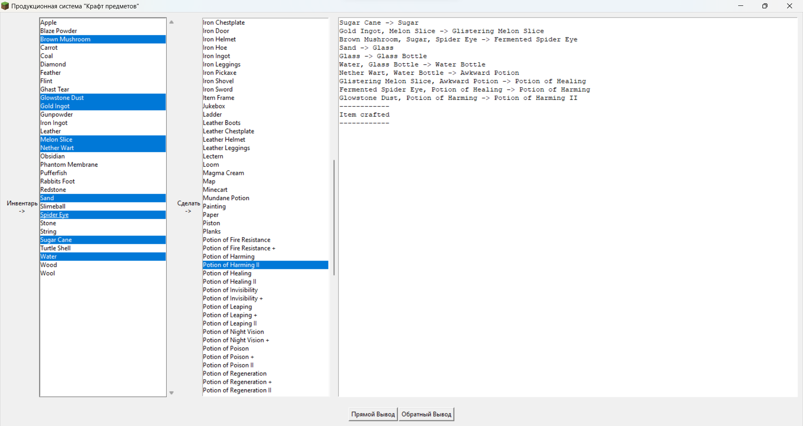

# Проект "Продукционная модель" по дисциплине "Интеллектуальные системы"

### Задание:
Реализовать продукционную модель с алгоритмами прямого и обратного вывода. Предметная область выбирается после консультации с преподавателем, факты и правила предметной области можно создавать группой студентов.

Выбранная предметная область - крафт предметов в игре Minecraft.

# Возможности программы
* Построение прямого и обратного вывода крафта игровых предметов
* Защита от зацикливания путем отслеживания путей вывода
* Отображение структуры И/Или графа в консоли при обратном выводе

# Пример работы



```
------------------------------------------------------------
|_ Type.Or Potion of Harming II True
    |_ Type.And Potion of Harming II True
        |_ Type.And Glowstone Dust True
        |_ Type.Or Potion of Harming True
            |_ Type.And Potion of Harming True
                |_ Type.And Potion of Healing True
                    |_ Type.And Awkward Potion True
                        |_ Type.And Water Bottle True
                            |_ Type.And Glass Bottle True
                                |_ Type.And Glass True
                                    |_ Type.And Sand True
                            |_ Type.And Water True
                        |_ Type.And Nether Wart True
                    |_ Type.And Glistering Melon Slice True
                        |_ Type.And Melon Slice True
                        |_ Type.And Gold Ingot True
                |_ Type.And Fermented Spider Eye True
                    |_ Type.And Brown Mushroom True
                    |_ Type.And Spider Eye True
                    |_ Type.And Sugar True
                        |_ Type.And Sugar Cane True
            |_ Type.And Potion of Harming False
                |_ Type.And Potion of Poison False
                    |_ Type.And Spider Eye False
                    |_ Type.And Awkward Potion False
                        |_ Type.And Water Bottle False
                            |_ Type.And Glass Bottle False
                                |_ Type.And Glass False
                                    |_ Type.And Sand False
                            |_ Type.And Water False
                        |_ Type.And Nether Wart False
                |_ Type.And Fermented Spider Eye False
                    |_ Type.And Brown Mushroom False
                    |_ Type.And Spider Eye False
                    |_ Type.And Sugar False
                        |_ Type.And Sugar Cane False
    |_ Type.And Potion of Harming II False
        |_ Type.And Fermented Spider Eye False
            |_ Type.And Brown Mushroom False
            |_ Type.And Spider Eye False
            |_ Type.And Sugar False
                |_ Type.And Sugar Cane False
        |_ Type.And Potion of Healing II False
            |_ Type.And Potion of Healing False
                |_ Type.And Awkward Potion False
                    |_ Type.And Water Bottle False
                        |_ Type.And Glass Bottle False
                            |_ Type.And Glass False
                                |_ Type.And Sand False
                        |_ Type.And Water False
                    |_ Type.And Nether Wart False
                |_ Type.And Glistering Melon Slice False
                    |_ Type.And Melon Slice False
                    |_ Type.And Gold Ingot False
            |_ Type.And Glowstone Dust False
    |_ Type.And Potion of Harming II False
        |_ Type.And Fermented Spider Eye False
            |_ Type.And Brown Mushroom False
            |_ Type.And Spider Eye False
            |_ Type.And Sugar False
                |_ Type.And Sugar Cane False
        |_ Type.And Potion of Poison II False
            |_ Type.And Potion of Poison False
                |_ Type.And Spider Eye False
                |_ Type.And Awkward Potion False
                    |_ Type.And Water Bottle False
                        |_ Type.And Glass Bottle False
                            |_ Type.And Glass False
                                |_ Type.And Sand False
                        |_ Type.And Water False
                    |_ Type.And Nether Wart False
            |_ Type.And Glowstone Dust False
------------------------------------------------------------
```
